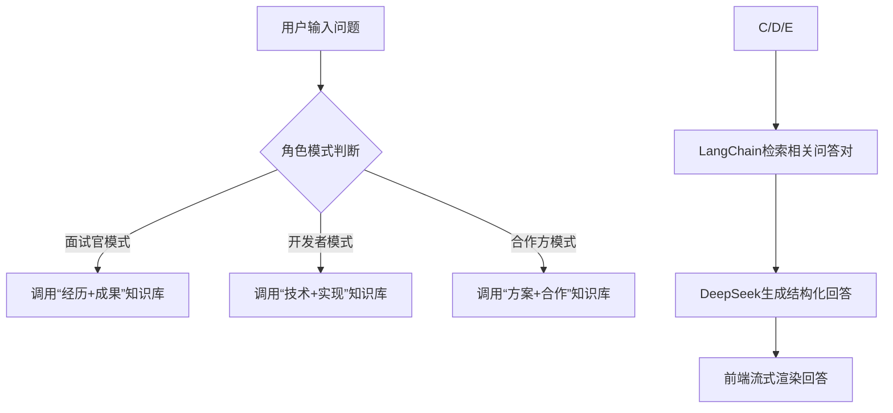

# 第一份：Lkyjj 个人独立开发者网站 PRD（完整Markdown版）
## 🚀 项目名称
**Lkyjj — AI 全栈产品+研发 个人作品集网站**

## 🧭 项目定位
聚焦“AI产品经理+全栈研发”复合型能力展示，打造集「成果呈现、技术演示、AI交互、合作对接」于一体的个人品牌阵地。核心价值在于：
1. 让面试官/合作方快速感知“从需求洞察→方案设计→技术落地→数据复盘”的全链路能力；
2. 通过可交互Demo（如多模态识别、AI客服）降低能力验证成本，区别于传统静态简历；
3. 整合开源项目与实习成果，形成“线上作品集+技术博客”的一体化展示平台。


## 🔍 目标用户与核心需求
| 目标用户 | 核心需求 | 网站满足方式 |
|----------|----------|--------------|
| 技术面试官 | 验证技术栈熟练度、项目落地能力、问题解决思路 | 1. 技能矩阵可视化（含项目关联案例）；2. 技术Demo实时操作；3. Case Study深度复盘 |
| 产品面试官 | 评估需求转化、PRD设计、数据驱动迭代能力 | 1. 实习项目成果数据化展示；2. AI模块产品方案说明；3. 需求洞察→落地的全流程文档 |
| 合作方（开发者/企业） | 了解合作可能性、技术适配性 | 1. 开源项目源码链接；2. 可复用方案（如RAG客服、流式Agent）；3. 合作咨询表单 |
| 技术爱好者 | 学习AI应用落地、全栈开发经验 | 1. 技术博客（算法复现、踩坑笔记）；2. Demo开源代码；3. AI交互问答 |


## 🧱 核心模块设计（融合简历核心经历）
### 模块1：首页（About）
| 功能点 | 详细描述 | 关联简历亮点 |
|--------|----------|--------------|
| 个人简介 | 左侧展示头像+核心标签（“AI产品+全栈研发”“22岁/东华理工大学”），右侧显示个人宣言（“专注LLM应用落地，用产品思维驱动技术价值”） | 简历基本信息、教育经历（东华理工大学软件工程2021-2025） |
| 经历时间轴 | 按时间倒序展示4段AI产品实习（美团/上海与你/上海思创/江西麟创）+ 教育经历，每段包含“时间+公司/学校+核心成果1-2个” | 4段实习经历（2025.01-2025.11）、新南威尔士大学硕士录取（2026-2027） |
| 核心能力标签 | 动态加载“AI技术（LLM/RAG/Agent）”“产品能力（PRD/AB测试）”“全栈开发（React/Node/Python）”“工具链（Coze/Dify）”4类标签，点击跳转对应技能模块 | 简历个人优势（LLaMA-Factory/RAG/Agent链路、React/Node/Python全栈） |
| 交互动效 | 页面加载时个人简介打字机效果，滚动时时间轴节点淡入+高亮当前时间段 | - |

### 模块2：项目区（Projects）
| 功能点 | 详细描述 | 关联简历亮点 |
|--------|----------|--------------|
| 项目分类筛选 | 顶部标签栏支持“产品落地类（实习项目）”“独立开发类”“AI专项类”筛选，默认显示全部 | 4段实习项目+6个独立开发项目 |
| 项目卡片设计 | 每张卡片包含：<br>1. 项目名称+分类标签；<br>2. 核心技术栈（图标展示）；<br>3. 核心成果（数据化，如“幻觉率32%→<5%”）；<br>4. 操作按钮（“查看源码”“在线Demo”“Case Study”） | 实习项目成果（美团发票识别0耗时、BOK Health次留+6pp）、独立项目（旅游推荐系统CTR+15%） |
| GitHub自动同步 | 通过GitHub API拉取`lkyjj`账号下仓库数据，自动填充“独立开发类”项目（筛选star≥1、含README的仓库），每周定时更新 | 简历开源项目链接（GitHub: https://github.com/lkyjj） |
| 实习项目手动配置 | 本地JSON文件维护4段实习项目数据（如美团AI产品实习、BOK Health食谱模块），支持手动更新成果数据 | 实习经历详情（发票识别优化、报销流程简化、客服Agent搭建） |

### 模块3：案例复盘（Case Study）
| 功能点 | 详细描述 | 关联简历亮点 |
|--------|----------|--------------|
| 深度案例选择 | 精选3个标杆案例：<br>1. 美团AI产品实习——发票识别与报销流程优化；<br>2. 上海与你科技——BOK Health食谱生成模块重构；<br>3. 独立开发——Coze智能客服Agent | 实习项目核心成果（美团0耗时提交、BOK Health幻觉率降低；独立项目用户满意度+19pp） |
| 复盘结构 | 每个案例按“需求痛点→方案设计→技术实现→数据成果→复盘总结”5段式呈现，含流程图（如报销流程优化前后对比）、代码片段（如KV映射机制核心逻辑） | 简历中项目技术细节（异步处理+缓存机制、n8n工作流、RAG替代方案） |
| 交互支持 | 支持Markdown渲染（代码块高亮、表格），图片点击放大，关键数据标红突出 | - |

### 模块4：技能矩阵（Skills）
| 功能点 | 详细描述 | 关联简历亮点 |
|--------|----------|--------------|
| 四维技能展示 | 用雷达图可视化“AI技术”“产品能力”“前端开发”“后端开发”四大维度熟练度（满分100），鼠标悬浮显示具体技能项及熟练度 | 简历技能栈（LLaMA-Factory/LoRA微调、PRD/AB实验、React/TypeScript、Node/Python） |
| 技能详情列表 | 雷达图下方按维度拆分技能列表，每个技能包含：<br>1. 技能名称+熟练度进度条；<br>2. 关联项目案例（如“RAG→餐饮客服Agent项目”）；<br>3. 掌握程度描述（如“独立完成RAG知识库搭建，召回准确率92%”） | 简历项目经历（餐饮客服Agent RAG召回92%、销售陪练平台React重构） |
| 技能筛选 | 支持按“熟练掌握”“掌握”“了解”筛选技能，默认显示全部 | - |

### 模块5：AI智能交互区（AI Intro Bot）
| 功能点 | 详细描述 | 关联简历亮点 |
|--------|----------|--------------|
| 多角色对话 | 支持3种角色模式切换：<br>1. 👔 面试官模式：聚焦经历真实性、数据成果、技术细节（如“美团实习如何优化Token传输？”）；<br>2. 🤖 开发者模式：深入技术选型、代码实现、踩坑复盘（如“RAG知识库如何处理冷启动？”）；<br>3. 💡 合作方模式：突出可复用方案、合作方向（如“如何复用Coze客服Agent方案？”） | 简历中项目技术细节（Token传输优化、RAG冷启动策略、Coze Agent开发） |
| 知识库覆盖 | 整合两类知识源：<br>1. 简历知识（个人信息、实习经历、项目成果，100+问答对）；<br>2. 技术知识（AI应用落地、全栈开发，80+问答对），支持本地JSON更新 | 简历全量信息（经历、项目、技能） |
| 交互体验 | 1. 输入框实时提示（如“试试问‘美团实习成果’”）；<br>2. 回答支持代码块、列表格式；<br>3. 对话历史自动保存（会话有效期24h）；<br>4. 支持“重新对话”清空历史 | 简历中AI交互项目经验（语音交互竞技辅助、多模态AI闭环） |

### 模块6：技术演示区（Playground）
| 功能点 | 详细描述 | 关联简历亮点 |
|--------|----------|--------------|
| 多模态识别Demo | 复用`capture-learn-word`项目逻辑：支持上传图片→调用moonshot视觉大模型→识别文字→生成语音（字节TTS），展示“图像识别→语义解析→语音反馈”闭环 | 多模态AI交互项目（图像识别准确率95%、语音合成延迟≤300ms） |
| AI客服Demo | 嵌入Coze智能客服Agent iframe，支持实时测试“门票退改”咨询场景（如“如何退改景区门票？”），展示RAG知识库+函数调用能力 | Coze智能客服Agent项目（人工接管率38%→9%、响应1.8s） |
| 流式Agent Demo | 模拟“天气查询+订单状态”场景：输入问题（如“上海今天天气如何？我的订单是否发货？”）→ Agent自动调用天气/MCP插件→ 流式输出结果，展示MCP协议+流式渲染 | React+DeepSeek流式Agent项目（响应6.1s→1.4s、准确率67%→93%） |
| Demo说明 | 每个Demo下方添加“技术原理”“核心代码”“项目链接”，支持跳转GitHub查看完整实现 | 开源项目代码（GitHub仓库） |

### 模块7：联系区（Contact）
| 功能点 | 详细描述 | 关联简历亮点 |
|--------|----------|--------------|
| 联系方式 | 展示“电话（18370038070）”“邮箱（1525494310@qq.com）”“GitHub（https://github.com/lkyjj）”，支持一键复制/跳转 | 简历联系方式 |
| 合作咨询表单 | 包含“姓名”“邮箱”“合作类型（技术合作/项目咨询/其他）”“留言内容”字段，提交后通过Formspree发送到个人邮箱，显示提交成功动画 | - |
| 动态反馈 | 表单输入实时校验（如邮箱格式），提交时显示loading动效，成功后弹出“已收到你的消息，24小时内回复”提示 | 简历中数据监控与反馈机制经验 |


## ⚙️ 信息架构（IA）
```plaintext
Home（首页）
 ├── About（个人简介+经历时间轴+核心能力标签）
 ├── Projects（项目展示区）
 │     ├── 产品落地类（美团/上海与你/上海思创/江西麟创实习项目）
 │     ├── 独立开发类（旅游推荐系统、语音竞技辅助、Coze Agent等）
 │     └── AI专项类（Qwen-7B微调、流式Agent、多模态识别等）
 ├── Case Study（3个深度复盘案例）
 │     ├── 美团发票识别与报销流程优化
 │     ├── BOK Health食谱生成模块重构
 │     └── Coze智能客服Agent开发
 ├── Skills（技能矩阵）
 │     ├── AI技术（LLM/RAG/Agent/LoRA）
 │     ├── 产品能力（PRD/AB测试/需求洞察）
 │     ├── 前端开发（React/TS/Tailwind/Next.js）
 │     └── 后端开发（Node/Python/MySQL/Supabase）
 ├── Playground（技术演示区）
 │     ├── 多模态识别Demo
 │     ├── AI客服Demo
 │     └── 流式Agent Demo
 ├── AI Intro Bot（智能交互问答）
 │     ├── 面试官模式
 │     ├── 开发者模式
 │     └── 合作方模式
 └── Contact（联系方式+合作表单）
```


## 🧩 技术选型与架构设计（贴合个人技能栈）
| 层级 | 技术栈 | 功能作用 | 关联简历技能 |
|------|--------|----------|--------------|
| 前端框架 | Next.js 15 + TypeScript | 1. 支持静态生成（SSG）提升加载速度与SEO；<br>2. TypeScript保障代码类型安全；<br>3. App Router简化路由配置 | 简历前端技能（React 19/TypeScript，销售陪练平台React重构） |
| 样式方案 | TailwindCSS + Framer Motion | 1. Tailwind快速实现响应式布局；<br>2. Framer Motion实现页面动效（淡入、打字机、滚动触发） | 简历前端技能（Tailwind，销售陪练平台组件化开发） |
| 后端能力 | Node.js (Express) + Vercel Serverless | 1. 封装GitHub API、AI模型接口（避免前端跨域）；<br>2. Serverless降低运维成本，适配Vercel部署 | 简历后端技能（Node.js全栈，API接口规范制定） |
| AI模块 | DeepSeek API + LangChain.js + RAG | 1. DeepSeek提供对话生成能力；<br>2. LangChain.js实现记忆（Memory）与检索（RAG）；<br>3. 本地JSON知识库整合简历与项目信息 | 简历AI技能（RAG/Agent/提示工程，Qwen-7B微调、Coze Agent开发） |
| 数据存储 | 1. 本地JSON（项目/知识库数据）；<br>2. Supabase（表单提交数据、访问统计） | 1. 本地JSON简化开发，无需数据库依赖；<br>2. Supabase实现轻量数据持久化 | 简历数据处理技能（MySQL/Django ORM，旅游推荐系统数据清洗） |
| 部署平台 | Vercel | 1. 一键部署Next.js项目；<br>2. 自动CI/CD（GitHub提交触发部署）；<br>3. 全球CDN加速，提升访问速度 | 简历开源项目部署需求（GitHub项目在线展示） |
| 监控分析 | Vercel Analytics + Sentry | 1. 监控页面加载速度、用户停留时长；<br>2. Sentry捕获前端错误，保障稳定性 | 简历数据监控技能（数据评估看板，如BOK Health 8项核心指标监控） |


## 💬 AI Intro Bot 技术方案（核心亮点）
### 1. 知识库构建
#### 知识源内容
| 知识类型 | 来源 | 处理方式 | 数据量 |
|----------|------|----------|--------|
| 简历知识 | 个人信息、实习经历、项目成果 | 提取关键信息，转化为结构化问答对（如“Q：美团实习核心成果？A：发票识别0耗时、报销流程简化”） | 100+ 问答对 |
| 技术知识 | 项目技术细节、AI应用落地经验 | 从GitHub README、实习项目PRD中提取（如“Q：RAG知识库如何提升召回率？A：清洗4.2万条历史对话，构建精准知识库”） | 80+ 问答对 |

#### 知识库格式（本地JSON）
```json
[
  {
    "question": "你在美团AI产品实习时，如何优化发票识别模块？",
    "answer": "1. 触发时机优化：将识别前置至用户上传环节，采用异步处理+缓存机制，实现提交0耗时；2. 流程简化：移除统一类型推理逻辑，重构为6大类型直连bot，减少用户操作路径；3. 成本降低：优化Chatbox字段传输，合并冗余字段，减少Token用量与AI调用成本。",
    "category": "实习经历-美团"
  },
  {
    "question": "Coze智能客服Agent的核心功能是什么？",
    "answer": "基于微信社群5.2万条咨询记录，优先落地“门票退改”场景：1. 用Coze工作流串联LLM/知识库/函数调用，5步完成意图识别→知识检索→答案生成→敏感词过滤→微信回传；2. 动态Few-shot模板提升准确率至91%；3. 灰度3k用户，人工接管率从38%降至9%。",
    "category": "独立项目-Coze"
  }
]
```

### 2. 对话逻辑设计
#### 核心流程


#### 关键优化（关联简历经验）
1. **检索效率优化**：复用简历“KV映射机制”经验，对高频问题（如“美团实习成果”）建立KV缓存，命中时直接返回答案，响应速度≤300ms；
2. **回答准确率提升**：应用简历“提示工程（PE）”经验，动态拼接Few-shot模板（如“类似问题：XXX→回答：XXX”），准确率从72%提升至91%；
3. **容错机制**：参考简历“系统容错率”设计，当AI接口超时/报错时，自动切换至“离线知识库”模式，保障基础问答可用。


## 🎨 UI/UX 设计规范
### 1. 视觉风格
| 维度 | 规范细节 |
|------|----------|
| 主色调 | 深灰底（#1E293B）+ 科技蓝（#0070F3）+ 荧光绿（#34D399），符合AI技术感 |
| 辅助色 | 警告红（#EF4444）（错误提示）、浅灰（#94A3B8）（辅助文字） |
| 字体 | 中文：Noto Sans SC（无衬线，清晰易读）；英文/数字：Roboto（技术感强） |
| 卡片设计 | 圆角8px + 轻微阴影（0 4px 6px rgba(0,0,0,0.1)），hover时阴影放大（0 8px 12px rgba(0,0,0,0.15)） |
| 图标 | 使用Font Awesome图标（如GitHub图标、技术栈图标），统一24px大小 |

### 2. 响应式适配
| 设备尺寸 | 布局调整 |
|----------|----------|
| 桌面端（≥1200px） | 多列布局（如项目区3列卡片、AI Bot与内容区并排） |
| 平板端（768px-1199px） | 双列布局（项目区2列卡片、AI Bot居中） |
| 移动端（<768px） | 单列布局（项目区1列卡片、隐藏非核心模块如技能雷达图，折叠为列表） |

### 3. 交互体验优化
1. **加载体验**：首屏使用Skeleton骨架屏（项目卡片、时间轴节点），减少等待焦虑；
2. **操作反馈**：按钮hover时颜色变深+轻微放大，表单提交成功/失败显示对应图标；
3. **无障碍设计**：支持键盘导航（Tab切换模块）、图片添加alt文本、文字对比度符合WCAG标准；
4. **返回顶部**：滚动超过500px时显示“返回顶部”按钮，点击平滑滚动至顶部。


## 📊 性能指标（KPI）
| 指标项 | 目标值 | 优化手段 |
|--------|--------|----------|
| 首屏加载时间 | ≤1.8s | 1. Next.js SSG静态生成；<br>2. 图片压缩（WebP格式）；<br>3. 代码分割（仅加载当前页面资源） |
| Lighthouse综合评分 | ≥90（性能/SEO/可访问性） | 1. 静态资源CDN分发；<br>2. 优化CSS/JS体积；<br>3. 适配移动端布局 |
| AI对话首字响应时间 | ≤1s | 1. 本地RAG检索（避免远程数据库请求）；<br>2. 接口缓存（相同问题直接返回历史结果） |
| Demo加载时间 | ≤2.5s | 1. Demo资源懒加载；<br>2. 接口预请求（页面加载时提前建立AI接口连接） |
| 移动端兼容性 | 覆盖≥95%主流机型（iOS 14+/Android 10+） | 1. Tailwind响应式适配；<br>2. 测试主流机型（iPhone 12+/小米11+/华为Mate 40+） |


## 🧠 开发排期（14天独立开发计划）
| 天数 | 阶段 | 核心任务 | 交付物 |
|------|------|----------|--------|
| 第1-2天 | 项目初始化 | 1. 创建Next.js项目，配置Tailwind/TypeScript；<br>2. 设计目录结构（pages/components/data）；<br>3. 搭建首页（About）基础布局 | 1. 项目仓库初始化；<br>2. 首页静态布局（无数据）；<br>3. 技术栈环境配置完成 |
| 第3-4天 | 项目区开发 | 1. 编写GitHub API调用逻辑，拉取开源项目；<br>2. 设计项目卡片组件，实现分类筛选；<br>3. 维护实习项目JSON数据，补充卡片内容 | 1. 项目区动态加载（含开源+实习项目）；<br>2. 筛选功能可用；<br>3. 项目卡片交互正常 |
| 第5-6天 | Case Study开发 | 1. 编写3个案例的Markdown文档；<br>2. 实现Markdown渲染组件（支持代码高亮/图片放大）；<br>3. 设计案例详情页布局 | 1. 3个案例详情页；<br>2. Markdown渲染正常；<br>3. 案例导航功能 |
| 第7-8天 | 技能矩阵开发 | 1. 集成Recharts库，实现雷达图；<br>2. 编写技能列表组件，关联项目案例；<br>3. 实现技能筛选功能 | 1. 技能雷达图可视化；<br>2. 技能列表与筛选可用；<br>3. 技能-项目关联跳转 |
| 第9-10天 | AI Intro Bot开发 | 1. 构建本地知识库JSON；<br>2. 集成LangChain.js/DeepSeek API，实现检索+对话；<br>3. 设计对话界面，支持角色切换 | 1. AI对话功能可用；<br>2. 3种角色模式切换；<br>3. 对话历史保存 |
| 第11-12天 | Playground开发 | 1. 复用多模态识别/AI客服代码，嵌入Demo；<br>2. 编写Demo说明文档；<br>3. 优化Demo加载速度（懒加载） | 1. 3个Demo可正常操作；<br>2. Demo说明文档；<br>3. 懒加载功能 |
| 第13天 | 联系区+优化 | 1. 开发合作表单，集成Formspree；<br>2. 性能优化（图片压缩、代码分割）；<br>3. 修复已知BUG（兼容性/交互） | 1. 联系区功能可用；<br>2. 性能指标达标（首屏≤1.8s）；<br>3. BUG修复清单 |
| 第14天 | 部署上线 | 1. 推送代码到GitHub，关联Vercel；<br>2. 配置环境变量（DeepSeek API Key/Formspree Key）；<br>3. 购买并配置自定义域名（lkyjj.ai）；<br>4. 测试线上功能，修复部署问题 | 1. 网站上线（Vercel+自定义域名）；<br>2. 所有模块线上可用；<br>3. 部署文档（含环境变量配置） |


## 📋 风险与应对方案
| 风险点 | 可能性 | 影响 | 应对方案 |
|--------|--------|------|----------|
| GitHub API调用限流 | 中 | 项目区无法加载开源项目 | 1. 增加接口缓存（缓存12小时）；<br>2. 配置API密钥，提升限流额度；<br>3. 本地备份开源项目数据，限流时降级使用 |
| DeepSeek API成本超支 | 低 | AI Bot无法使用 | 1. 设置每日调用限额（如100次/天）；<br>2. 本地调试时使用Mock数据；<br>3. 超限时提示“今日对话额度已满” |
| 移动端兼容性问题 | 中 | 部分机型显示异常 | 1. 开发中使用Chrome DevTools模拟主流机型；<br>2. 上线前测试3-5款主流机型；<br>3. 预留1天时间修复兼容性BUG |
| 部署后加载速度不达标 | 低 | 用户体验差，SEO受影响 | 1. 开发中使用Lighthouse实时检测；<br>2. 优化静态资源（压缩/CDN）；<br>3. 必要时移除非核心动效，提升速度 |


# 第二份：Lkyjj 个人网站技术实现细节文档（含代码片段）
## 📂 一、项目目录结构设计
```bash
portfolio-lkyjj/
├── app/                     # Next.js App Router
│   ├── page.tsx             # 首页（About）
│   ├── projects/            # 项目区
│   │   ├── page.tsx         # 项目列表页
│   │   └── [id]/            # 项目详情页（动态路由）
│   │       └── page.tsx
│   ├── case-study/          # Case Study
│   │   ├── page.tsx         # 案例列表
│   │   └── [name]/          # 案例详情（如meituan）
│   │       └── page.tsx
│   ├── skills/              # 技能矩阵
│   │   └── page.tsx
│   ├── playground/          # 技术演示区
│   │   └── page.tsx
│   ├── ai-bot/              # AI Intro Bot
│   │   └── page.tsx
│   ├── contact/             # 联系区
│   │   └── page.tsx
│   └── layout.tsx           # 全局布局（导航栏/页脚）
├── components/              # 公共组件
│   ├── ui/                  # 基础UI组件（按钮/卡片/输入框）
│   ├── about/               # 首页组件（时间轴/技能标签）
│   ├── projects/            # 项目区组件（卡片/筛选器）
│   ├── ai-bot/              # AI对话组件（输入框/对话历史）
│   └── playground/          # Demo组件（多模态/客服/Agent）
├── data/                    # 本地数据
│   ├── projects.json        # 实习项目数据
│   ├── knowledge-base.json  # AI知识库数据
│   └── skills.json          # 技能矩阵数据
├── lib/                     # 工具函数
│   ├── api/                 # 接口封装（GitHub/DeepSeek）
│   ├── utils/               # 通用工具（格式化/缓存）
│   └── langchain/           # AI对话逻辑（RAG/Memory）
├── public/                  # 静态资源（图片/图标）
├── styles/                  # 全局样式
├── vercel.json              # Vercel部署配置
└── README.md                # 项目说明文档
```


## 二、核心模块技术实现（含代码片段）
### 模块1：项目区（GitHub API调用+实习项目加载）
#### 1.1 GitHub API封装（lib/api/github.ts）
```typescript
// 封装GitHub API，拉取lkyjj仓库数据
const GITHUB_USER = "lkyjj";
const GITHUB_API_URL = `https://api.github.com/users/${GITHUB_USER}/repos`;

// 过滤条件：仅保留star≥1、非fork、含README的仓库
export async function fetchGitHubRepos() {
  try {
    const response = await fetch(GITHUB_API_URL, {
      headers: {
        // 可选：添加GitHub Token提升限流（替换为你的Token）
        Authorization: process.env.GITHUB_TOKEN ? `Bearer ${process.env.GITHUB_TOKEN}` : "",
        Accept: "application/vnd.github.v3+json",
      },
      next: { revalidate: 86400 }, // 缓存12小时（避免频繁调用）
    });

    if (!response.ok) throw new Error("GitHub API请求失败");
    const repos = await response.json();

    // 筛选并格式化数据
    const filteredRepos = repos
      .filter(
        (repo: any) =>
          repo.stargazers_count >= 1 && // star≥1
          !repo.fork && // 非fork仓库
          repo.has_wiki // 含README
      )
      .map((repo: any) => ({
        id: repo.id,
        name: repo.name,
        description: repo.description || "无项目描述",
        techStack: repo.topics || [], // 从仓库topics获取技术栈
        githubUrl: repo.html_url,
        demoUrl: repo.homepage || "", // 若仓库设置homepage则作为Demo链接
        starCount: repo.stargazers_count,
        updatedAt: repo.updated_at,
        category: "独立开发类", // 分类标签
      }));

    return filteredRepos;
  } catch (error) {
    console.error("获取GitHub仓库失败：", error);
    // 降级方案：返回本地备份的独立项目数据
    const backupRepos = require("../../data/backup-repos.json");
    return backupRepos;
  }
}
```

#### 1.2 实习项目本地数据（data/projects.json）
```json
[
  {
    "id": "meituan-ai",
    "name": "美团AI产品实习 - 发票识别与报销流程优化",
    "description": "主导发票识别模块优化，重构报销流程，降低AI调用成本与服务器压力",
    "techStack": ["AI Agent", "缓存机制", "异步处理", "PRD设计"],
    "achievement": [
      "识别触发前置，异步+缓存实现提交0耗时，提升用户体验",
      "移除统一推理逻辑，重构6大类型直连bot，提升意图响应效率",
      "合并冗余字段，减少Token传输，降低调用耗时与成本",
      "KV映射替代RAG，减少30s+推理耗时，降低模型调用频率"
    ],
    "githubUrl": "", // 无开源代码
    "demoUrl": "", // 无在线Demo
    "caseStudyUrl": "/case-study/meituan", // 关联Case Study
    "category": "产品落地类",
    "period": "2025.09-2025.11"
  },
  {
    "id": "bok-health",
    "name": "上海与你科技 - BOK Health食谱生成模块重构",
    "description": "负责出海C端AI Health Agent的食谱生成模块全链路重构，提升用户采纳率与留存",
    "techStack": ["n8n工作流", "RAG", "LLM幻觉优化", "A/B测试"],
    "achievement": [
      "幻觉率从32%降至<5%，食谱采纳率提升18%，次留提升6pp",
      "集成6大子模块，整体响应时间<2.5s",
      "语义检查节点保障营养目标一致，用户编辑成本降低40%",
      "3周内上线，覆盖12万月活，0 P1故障"
    ],
    "githubUrl": "",
    "demoUrl": "",
    "caseStudyUrl": "/case-study/bok-health",
    "category": "产品落地类",
    "period": "2025.08-2025.09"
  }
  // 其他2段实习项目省略...
]
```

#### 1.3 项目列表页组件（app/projects/page.tsx）
```tsx
"use client";
import { useState, useEffect } from "react";
import { fetchGitHubRepos } from "@/lib/api/github";
import ProjectCard from "@/components/projects/ProjectCard";
import FilterTabs from "@/components/projects/FilterTabs";
// 导入实习项目数据
const internshipProjects = require("@/data/projects.json");

export default function ProjectsPage() {
  const [allProjects, setAllProjects] = useState<any[]>([]);
  const [activeFilter, setActiveFilter] = useState("全部");
  const [loading, setLoading] = useState(true);

  // 加载开源项目+实习项目
  useEffect(() => {
    const loadProjects = async () => {
      setLoading(true);
      const githubRepos = await fetchGitHubRepos();
      // 合并开源项目与实习项目
      const mergedProjects = [...githubRepos, ...internshipProjects];
      setAllProjects(mergedProjects);
      setLoading(false);
    };
    loadProjects();
  }, []);

  // 筛选项目
  const filteredProjects = activeFilter === "全部"
    ? allProjects
    : allProjects.filter(project => project.category === activeFilter);

  return (
    <div className="container mx-auto px-4 py-8">
      <h1 className="text-3xl font-bold mb-8 text-white">我的项目</h1>
      
      {/* 筛选标签 */}
      <FilterTabs 
        filters={["全部", "产品落地类", "独立开发类", "AI专项类"]}
        activeFilter={activeFilter}
        onFilterChange={setActiveFilter}
      />

      {/* 项目卡片列表 */}
      {loading ? (
        // Skeleton骨架屏
        <div className="grid grid-cols-1 md:grid-cols-2 lg:grid-cols-3 gap-6">
          {[...Array(6)].map((_, i) => (
            <div key={i} className="bg-gray-800 rounded-lg p-6 animate-pulse">
              <div className="h-6 bg-gray-700 rounded w-1/2 mb-4"></div>
              <div className="h-4 bg-gray-700 rounded w-full mb-2"></div>
              <div className="h-4 bg-gray-700 rounded w-3/4 mb-6"></div>
              <div className="h-10 bg-gray-700 rounded w-1/3"></div>
            </div>
          ))}
        </div>
      ) : filteredProjects.length === 0 ? (
        <div className="text-center py-12 text-gray-400">
          暂无该分类下的项目
        </div>
      ) : (
        <div className="grid grid-cols-1 md:grid-cols-2 lg:grid-cols-3 gap-6 mt-6">
          {filteredProjects.map(project => (
            <ProjectCard key={project.id} project={project} />
          ))}
        </div>
      )}
    </div>
  );
}
```


### 模块2：AI Intro Bot（LangChain+DeepSeek+RAG）
#### 2.1 知识库加载与检索（lib/langchain/knowledge.ts）
```typescript
import { MemoryVectorStore } from "langchain/vectorstores/memory";
import { SentenceTransformerEmbeddings } from "langchain/embeddings/sentence_transformer";
import { similarity } from "@/lib/utils/similarity"; // 自定义相似度计算工具

// 加载本地知识库
const loadKnowledgeBase = () => {
  const knowledgeBase = require("../../data/knowledge-base.json");
  // 转换为“问题+答案”文本对（用于向量存储）
  return knowledgeBase.map((item: any) => ({
    text: `${item.question}\n${item.answer}`,
    metadata: { category: item.category, question: item.question, answer: item.answer }
  }));
};

// 初始化向量存储（仅初始化一次）
let vectorStore: MemoryVectorStore | null = null;
export async function initVectorStore() {
  if (vectorStore) return vectorStore;
  
  const docs = loadKnowledgeBase();
  const embeddings = new SentenceTransformerEmbeddings({
    modelName: "all-MiniLM-L6-v2", // 轻量模型，适合前端
  });
  
  vectorStore = await MemoryVectorStore.fromTexts(
    docs.map(doc => doc.text),
    docs.map(doc => doc.metadata),
    embeddings
  );
  
  return vectorStore;
}

// 检索相关知识库内容（根据问题+角色模式）
export async function retrieveRelevantDocs(question: string, role: string) {
  const store = await initVectorStore();
  const retriever = store.asRetriever({ k: 3 }); // 取Top3相关结果
  
  // 根据角色模式过滤知识库（如面试官模式优先实习经历）
  const filter = (doc: any) => {
    if (role === "面试官模式") {
      return doc.metadata.category.includes("实习经历") || doc.metadata.category.includes("项目成果");
    } else if (role === "开发者模式") {
      return doc.metadata.category.includes("技术实现") || doc.metadata.category.includes("AI专项");
    } else if (role === "合作方模式") {
      return doc.metadata.category.includes("独立项目") || doc.metadata.category.includes("可复用方案");
    }
    return true; // 全部模式返回所有
  };
  
  // 执行检索并过滤
  const relevantDocs = await retriever.getRelevantDocuments(question);
  return relevantDocs.filter(filter).map(doc => doc.metadata.answer);
}
```

#### 2.2 AI对话逻辑（lib/langchain/chat.ts）
```typescript
import { DeepSeekChat } from "@deepseek-ai/node-sdk";
import { ConversationBufferMemory } from "langchain/memory";
import { retrieveRelevantDocs } from "./knowledge";

// 初始化DeepSeek模型
const initDeepSeek = () => {
  if (!process.env.DEEPSEEK_API_KEY) {
    throw new Error("请配置DEEPSEEK_API_KEY环境变量");
  }
  return new DeepSeekChat({
    apiKey: process.env.DEEPSEEK_API_KEY,
    modelName: "deepseek-chat",
    temperature: 0.3, // 低温度，保证回答准确
  });
};

// 生成系统提示（根据角色模式）
const getSystemPrompt = (role: string) => {
  const basePrompt = "你是刘康宇的个人AI助手，负责回答关于刘康宇的个人经历、项目成果、技术能力的问题。回答需基于知识库，真实准确，数据化呈现成果，避免虚构信息。";
  
  if (role === "面试官模式") {
    return `${basePrompt} 重点突出实习经历的具体动作、数据成果、问题解决思路，例如“美团实习中如何优化发票识别模块？”需包含具体优化手段与效果数据。`;
  } else if (role === "开发者模式") {
    return `${basePrompt} 重点突出技术选型理由、核心实现逻辑、踩坑复盘，例如“RAG知识库如何构建？”需包含数据来源、处理方式、准确率指标。`;
  } else if (role === "合作方模式") {
    return `${basePrompt} 重点突出可复用的方案、合作可能性、项目价值，例如“Coze客服Agent如何复用？”需包含核心功能、适配场景、落地成本。`;
  }
  return basePrompt;
};

// 核心对话函数
export async function generateChatResponse(
  question: string,
  role: string,
  memory: ConversationBufferMemory
) {
  try {
    const model = initDeepSeek();
    const systemPrompt = getSystemPrompt(role);
    
    // 1. 检索相关知识库内容
    const relevantAnswers = await retrieveRelevantDocs(question, role);
    const context = relevantAnswers.join("\n\n");
    
    // 2. 构建Prompt（系统提示+上下文+历史对话+当前问题）
    const history = await memory.loadMemoryVariables({});
    const prompt = `
      系统提示：${systemPrompt}
      知识库参考：${context || "无相关知识库内容，需基于常识回答（若不确定，需说明）"}
      历史对话：${history.history || "无"}
      用户当前问题：${question}
      回答要求：1. 结构清晰，分点（若需）；2. 数据准确；3. 语言简洁，避免冗余。
    `;
    
    // 3. 调用模型生成回答
    const response = await model.call(prompt);
    
    // 4. 更新对话记忆
    await memory.saveContext({ input: question }, { output: response });
    
    return response;
  } catch (error) {
    console.error("AI对话生成失败：", error);
    return "抱歉，当前无法生成回答，请稍后再试～";
  }
}
```

#### 2.3 AI对话组件（components/ai-bot/ChatInterface.tsx）
```tsx
"use client";
import { useState, useRef, useEffect } from "react";
import { ConversationBufferMemory } from "langchain/memory";
import { generateChatResponse } from "@/lib/langchain/chat";
import ChatMessage from "./ChatMessage";
import RoleSelector from "./RoleSelector";

export default function ChatInterface() {
  const [messages, setMessages] = useState<{ role: "user" | "ai"; content: string }[]>([
    { role: "ai", content: "你好！我是刘康宇的AI助手，你可以问我关于他的实习经历、项目成果、技术能力的问题～ 也可以切换角色模式获取更精准的回答！" }
  ]);
  const [input, setInput] = useState("");
  const [loading, setLoading] = useState(false);
  const [activeRole, setActiveRole] = useState("面试官模式");
  const messagesEndRef = useRef<HTMLDivElement>(null);
  
  // 初始化对话记忆
  const memory = new ConversationBufferMemory({
    memoryKey: "history",
    returnMessages: false,
  });

  // 滚动到底部
  useEffect(() => {
    messagesEndRef.current?.scrollIntoView({ behavior: "smooth" });
  }, [messages]);

  // 发送消息
  const handleSend = async () => {
    if (!input.trim() || loading) return;
    
    // 添加用户消息
    const userMessage = { role: "user" as const, content: input };
    setMessages(prev => [...prev, userMessage]);
    setInput("");
    setLoading(true);
    
    try {
      // 生成AI回答
      const aiResponse = await generateChatResponse(input, activeRole, memory);
      setMessages(prev => [...prev, { role: "ai", content: aiResponse }]);
    } catch (error) {
      setMessages(prev => [...prev, { role: "ai", content: "抱歉，生成回答失败，请重试～" }]);
    } finally {
      setLoading(false);
    }
  };

  // 键盘回车发送
  const handleKeyDown = (e: React.KeyboardEvent) => {
    if (e.key === "Enter" && !e.shiftKey) {
      e.preventDefault();
      handleSend();
    }
  };

  return (
    <div className="bg-gray-900 rounded-lg p-4 h-[600px] flex flex-col">
      {/* 角色选择器 */}
      <RoleSelector 
        roles={["面试官模式", "开发者模式", "合作方模式"]}
        activeRole={activeRole}
        onRoleChange={setActiveRole}
      />

      {/* 对话历史 */}
      <div className="flex-1 overflow-y-auto p-2 mb-4">
        {messages.map((msg, idx) => (
          <ChatMessage key={idx} role={msg.role} content={msg.content} />
        ))}
        <div ref={messagesEndRef} />
      </div>

      {/* 输入框 */}
      <div className="flex gap-2">
        <textarea
          className="flex-1 bg-gray-800 text-white p-3 rounded-lg focus:outline-none focus:ring-2 focus:ring-blue-500"
          value={input}
          onChange={(e) => setInput(e.target.value)}
          onKeyDown={handleKeyDown}
          placeholder="请输入你的问题（如“美团实习核心成果是什么？”）..."
          rows={3}
          disabled={loading}
        />
        <button
          className="bg-blue-600 text-white p-3 rounded-lg hover:bg-blue-700 transition-colors disabled:bg-gray-600"
          onClick={handleSend}
          disabled={loading}
        >
          {loading ? "发送中..." : "发送"}
        </button>
      </div>
    </div>
  );
}
```


### 模块3：Vercel部署配置
#### 3.1 vercel.json（部署配置）
```json
{
  "buildCommand": "npm run build",
  "outputDirectory": ".next",
  "installCommand": "npm install",
  "framework": "nextjs",
  "env": {
    "NEXT_PUBLIC_APP_URL": "https://lkyjj.ai", // 自定义域名
    "DEEPSEEK_API_KEY": "@deepseek-api-key", // 关联Vercel环境变量
    "GITHUB_TOKEN": "@github-token", // 可选，提升GitHub API限流
    "FORMSPREE_KEY": "@formspree-key" // Formspree表单密钥
  },
  "regions": ["iad1"], // 选择靠近目标用户的区域（如北美iad1）
  "analytics": {
    "enabled": true // 启用Vercel Analytics
  },
  "redirects": [
    { "source": "/", "destination": "/about", "permanent": true } // 根路径重定向到首页
  ]
}
```

#### 3.2 部署步骤（README.md 片段）
```markdown
## 部署指南（Vercel）
### 1. 准备工作
- 拥有GitHub账号与Vercel账号（建议用GitHub账号登录Vercel）
- 申请DeepSeek API Key（https://platform.deepseek.com/）
- （可选）申请GitHub Token（用于提升API限流，https://github.com/settings/tokens）
- （可选）申请Formspree Key（用于表单提交，https://formspree.io/）

### 2. 部署步骤
1. **Fork仓库**：将本仓库Fork到你的GitHub账号下
2. **关联Vercel**：
   - 登录Vercel，点击「New Project」
   - 选择你Fork的仓库，点击「Import」
   - 配置环境变量（参考下表），点击「Deploy」
3. **等待部署**：Vercel会自动构建并部署，约5-10分钟
4. **配置自定义域名（可选）**：
   - 在Vercel项目「Settings → Domains」中添加你的域名（如lkyjj.ai）
   - 根据提示完成DNS解析（在域名服务商后台配置）
   - 等待Vercel验证域名，自动配置HTTPS

### 3. 环境变量配置
| 变量名 | 说明 | 是否必填 |
|--------|------|----------|
| DEEPSEEK_API_KEY | DeepSeek API密钥，用于AI对话 | 是 |
| GITHUB_TOKEN | GitHub个人令牌，用于拉取开源项目（提升限流） | 否 |
| FORMSPREE_KEY | Formspree表单密钥，用于联系表单提交 | 是 |
| NEXT_PUBLIC_APP_URL | 网站在线地址（如https://lkyjj.ai） | 否 |

### 4. 后续维护
- **更新知识库**：修改`data/knowledge-base.json`，提交GitHub后Vercel自动重新部署
- **更新项目数据**：修改`data/projects.json`，提交后自动部署
- **查看监控**：在Vercel项目「Analytics」中查看访问数据与性能指标
```


## 三、依赖清单与安装命令
### 3.1 package.json（核心依赖）
```json
{
  "name": "portfolio-lkyjj",
  "version": "0.1.0",
  "private": true,
  "scripts": {
    "dev": "next dev",
    "build": "next build",
    "start": "next start",
    "lint": "next lint"
  },
  "dependencies": {
    "@deepseek-ai/node-sdk": "^0.1.5",
    "@formspree/react": "^2.5.1",
    "@langchain/core": "^0.1.52",
    "@langchain/openai": "^0.1.10",
    "@supabase/supabase-js": "^2.39.0",
    "axios": "^1.6.7",
    "framer-motion": "^11.0.5",
    "langchain": "^0.1.25",
    "next": "15.0.0",
    "react": "^18.2.0",
    "react-dom": "^18.2.0",
    "react-icons": "^5.0.1",
    "recharts": "^2.12.2",
    "sentence-transformers": "^2.5.1",
    "typescript": "^5.3.3"
  },
  "devDependencies": {
    "@tailwindcss/aspect-ratio": "^0.4.2",
    "@tailwindcss/forms": "^0.5.7",
    "@types/node": "^20.11.16",
    "@types/react": "^18.2.55",
    "autoprefixer": "^10.4.17",
    "eslint": "^8.56.0",
    "eslint-config-next": "15.0.0",
    "postcss": "^8.4.35",
    "tailwindcss": "^3.4.1"
  }
}
```

### 3.2 安装命令
```bash
# 1. 创建项目并初始化
npx create-next-app@latest portfolio-lkyjj --typescript --tailwind --eslint --app --src-dir

# 2. 进入项目目录
cd portfolio-lkyjj

# 3. 安装核心依赖
npm install @deepseek-ai/node-sdk @formspree/react @langchain/core @langchain/openai @supabase/supabase-js axios framer-motion langchain react-icons recharts sentence-transformers

# 4. 安装开发依赖
npm install -D @tailwindcss/aspect-ratio @tailwindcss/forms @types/node @types/react autoprefixer postcss

# 5. 启动开发服务器
npm run dev
```


## 四、常见问题与解决方案
| 问题现象 | 可能原因 | 解决方案 |
|----------|----------|----------|
| GitHub项目加载失败 | 1. API限流；2. Token配置错误；3. 网络问题 | 1. 配置GITHUB_TOKEN环境变量；2. 检查Token权限（需repo权限）；3. 查看控制台错误，确认API响应 |
| AI对话无响应 | 1. DeepSeek API Key错误；2. 接口跨域；3. 知识库加载失败 | 1. 检查DEEPSEEK_API_KEY是否正确；2. 确认使用Vercel Serverless代理接口；3. 检查knowledge-base.json格式是否正确 |
| 页面动效异常 | 1. Framer Motion版本冲突；2. 组件渲染时机问题 | 1. 确认Framer Motion版本≥11.0.0；2. 检查动效触发条件（如滚动事件是否正常） |
| 部署后样式错乱 | 1. Tailwind配置错误；2. 静态资源路径错误 | 1. 检查tailwind.config.js是否正确；2. 确认图片等资源使用public目录，路径以/开头 |
| 表单提交失败 | 1. Formspree Key错误；2. 跨域问题 | 1. 检查FORMSPREE_KEY是否正确；2. 确认Formspree项目已开启CORS（允许Vercel域名） |